# azure-secure-network-architecture
Secure Hub-and-Spoke architecture in Azure with Bastion, Private Endpoint, and Backup strategy.

# Azure Hub-and-Spoke Network Architecture

## Overview

This project demonstrates a Hub-and-Spoke architecture built in Microsoft Azure, designed to provide:

* Secure administrative access
* Network segmentation between environments
* Centralized traffic control
* Private resource access
* Backup and recovery strategy

---

## Architecture Diagram

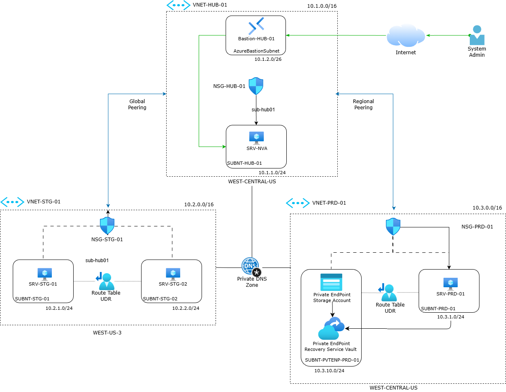

---

## Objectives

* Implement a scalable and secure network topology
* Avoid public exposure of virtual machines
* Control traffic using a centralized hub
* Enable private communication with PaaS services
* Ensure data protection with backup solutions

---

## Architecture Components

### Hub Network (VNET-HUB-01)

The hub acts as the central point for connectivity and security.

Components:

* Azure Bastion for secure VM access (no public IP)
* Network Virtual Appliance (NVA) for traffic inspection and routing
* Network Security Group (NSG)

---

### Spoke Networks

#### Staging (VNET-STG-01)

* Virtual machines for testing
* Custom route table (UDR)
* NSG applied

#### Production (VNET-PRD-01)

* Application VM
* Storage Account
* Recovery Services Vault
* UDR for traffic control
* NSG for security

---

## Connectivity

* VNet Peering

  * Hub ↔ Staging (Global Peering)
  * Hub ↔ Production (Regional Peering)

* Routing

  * Custom routes (UDR) force traffic through the NVA

---

## Security Design

* No public IPs assigned to virtual machines
* Secure access via Azure Bastion
* NSGs restrict inbound and outbound traffic
* Private DNS Zone for internal name resolution
* Private Endpoint for secure access to PaaS services

---

## DNS Resolution

Private DNS Zones are used to resolve private endpoints:

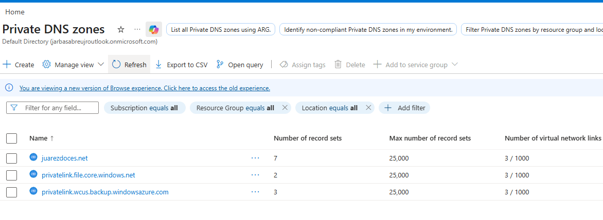

---

## Traffic Flow

Traffic between spokes is routed through the NVA in the hub, enabling:

* Traffic inspection
* Centralized control
* Future firewall integration

---

## Backup Strategy

The environment includes:

* Recovery Services Vault
* Backup policies applied to workloads

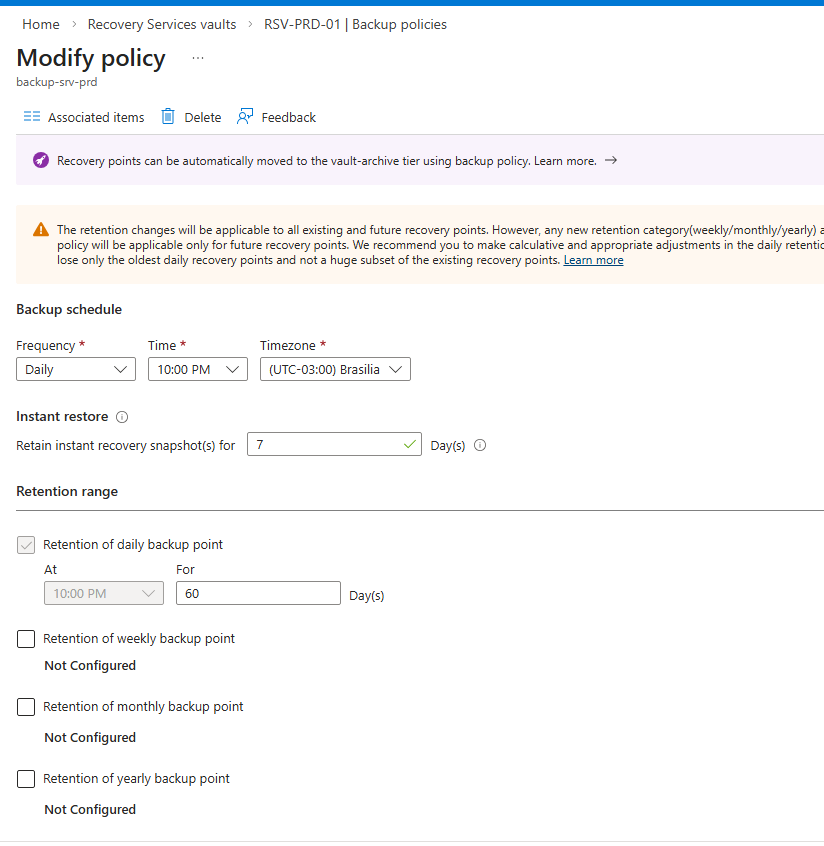
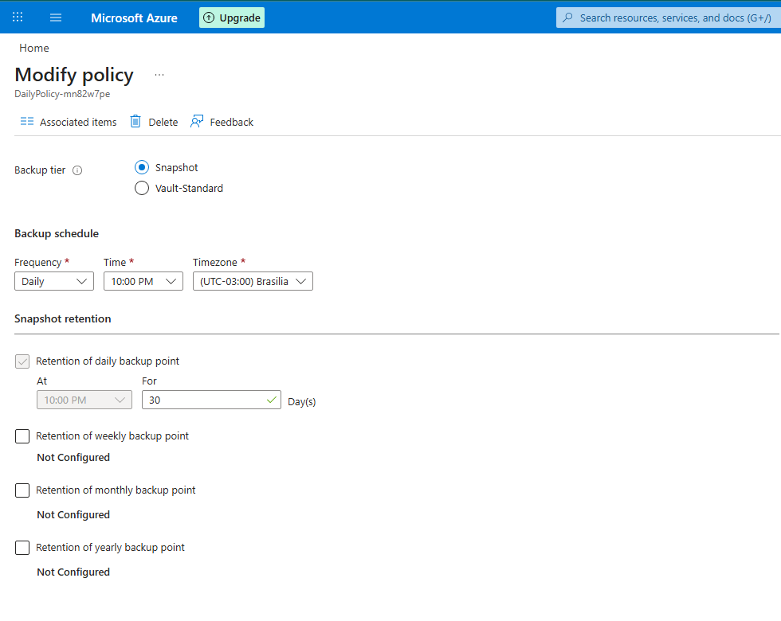

---

## Key Screenshots

### Networking

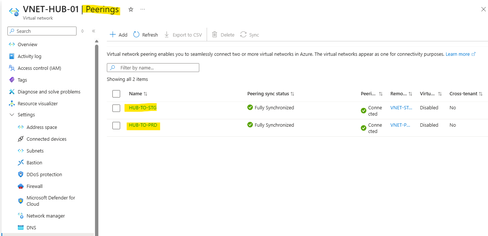
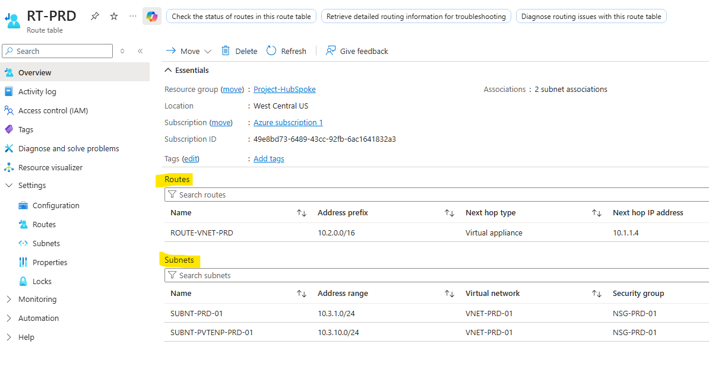

### Security

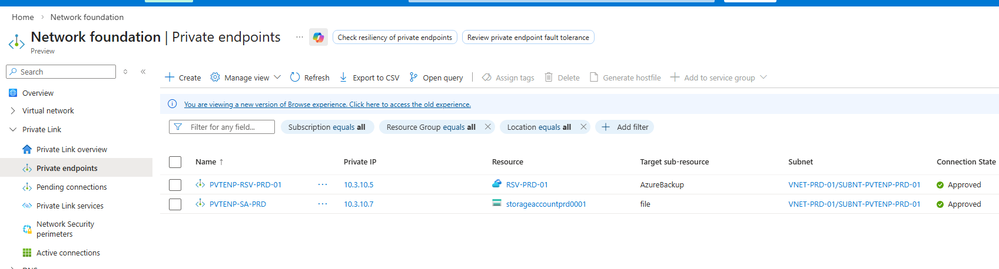
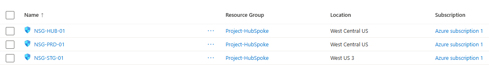

### Access

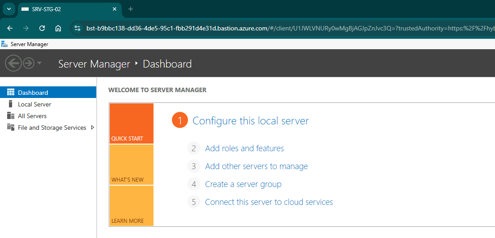

---

## Validation

This section demonstrates the validation tests performed to ensure the architecture is working as expected, covering connectivity, security, private access, and data protection.

### Connectivity Test (Ping)

Basic connectivity between resources was validated using ICMP (ping), confirming proper network communication across the hub-and-spoke topology.

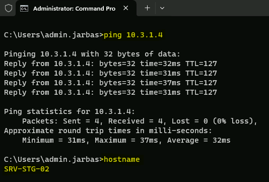

---

### Private Endpoint – File Share Mapping

A file share was successfully mapped using a Private Endpoint, ensuring access occurs through a private IP instead of the public internet.

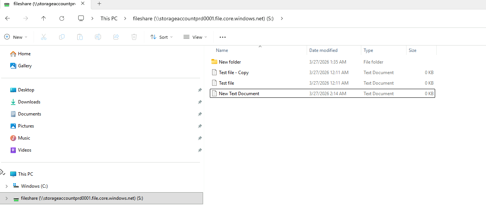

---

### External Access Restriction (Security Validation)

An external access test was performed from a non-authorized machine attempting to reach the Storage Account.

As expected:

* Access was denied
* Public access is properly restricted
* Private Endpoint enforcement is working correctly

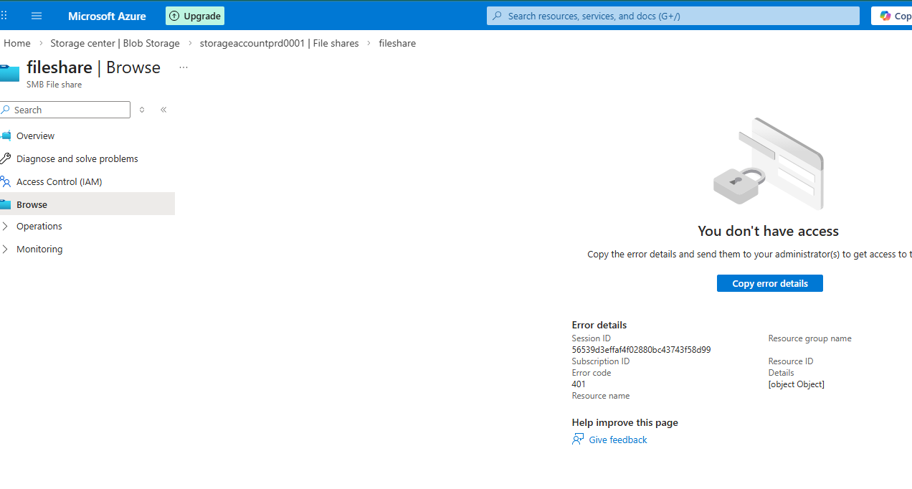

---

### Backup Validation (Recovery Services Vault)

Backup operations were successfully executed using a Recovery Services Vault, confirming that data protection is properly configured.

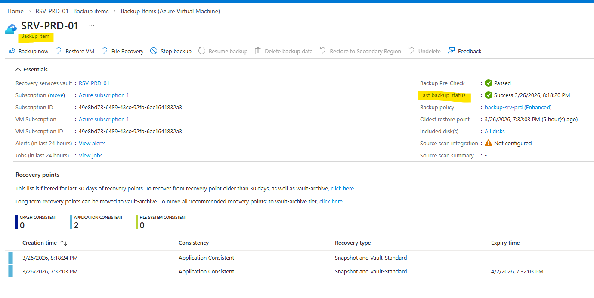

---

## Key Learnings

* Designing hub-and-spoke architectures in Azure
* Implementing secure access without public endpoints
* Using UDRs for advanced traffic control
* Configuring Private DNS and Private Endpoints
* Applying backup and recovery strategies

---

## Future Improvements

* Implement high availability for NVA (active/active)
* Add Azure Firewall for enhanced security
* Integrate Azure Monitor and Log Analytics
* Enable Availability Zones for critical components

---

## Author

Project created as part of hands-on cloud architecture practice.

---

## Notes

This project reflects real-world design patterns commonly used in enterprise cloud environments.
